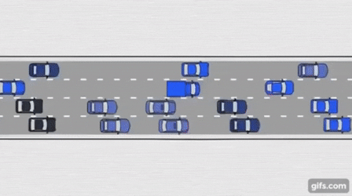

# Unite App HackUST-2017
Built in less than 24 hours
- Android Application by Daniel Strizhevsky
- Node.js backend by Alkin Sen 
    
The idea is to reduce the traffic in crowded cities like Hong Kong. Our aim is to reduce the number of taxis or private cars by grouping up people who are close to each other and wants to go the same location. However, carpooling causes even more traffic when the car collects everyone one by one.

Our app is called Unite and we minimize the total distance walked when pairing up the passengers while avoiding the congestions zones which were found using the data Uber provided during the hackathon. The idea is very similar to expressPool but when we came up with it bu expressPool came out after this project. Our main distinction is that we choose meeting points so that the traffic is also avoided and in fact reduced. The following gif explains how traffic occurs.

Ranked in the top 5 with our RideSharing app in the HackUST 2017

